# 🍝 Marinara Engine

<h3><b>Fun. Intuitive. Plug-And-Play.</b></h3>

  <b>A local, AI-powered chat, roleplay, and game engine</b> built around one idea: <b>you install it, you run it, and it just works. Oh, and don't forget about the part where you have fun! ALSO, HEY, LOOK, IT'S FREE.</b> 
  Created with agentic use in mind, allowing multiple requests at once. Everything is connected. Chat with your characters OOC about your roleplays. Have them create RP scenes for you. All designed with simplicity in mind: we don't want to spend hours on setup, we just want to play. 
  This is a full-on passion project; it started as a small personal playground, but over time it grew into something enormous. Thank you all for your support. 

---

> **⚠️ Beta Software** — Work in progress. Expect rough edges, missing features, and breaking changes. Bug reports and feedback are very welcome!

---

> **Fully optional multiplayer:** Private shared sessions require two explicit opt-ins and a trusted client for every participant. See [multiplayer setup and limits](docs/CONFIGURATION.md#optional-multiplayer).

## Table of Contents

- [🍝 Marinara Engine](#-marinara-engine)
  - [Table of Contents](#table-of-contents)
  - [Screenshots](#screenshots)
  - [Latest Release](#latest-release)
  - [Installation](#installation)
  - [Features](#features)
    - [Chat \& Roleplay](#chat--roleplay)
    - [Visual \& Immersive](#visual--immersive)
    - [Appearance \& Themes](#appearance--themes)
    - [AI Agent System](#ai-agent-system)
    - [Prompt Engineering](#prompt-engineering)
    - [Local Customization](#local-customization)
    - [Connections \& Providers](#connections--providers)
    - [Export \& Data](#export--data)
  - [Documentation](#documentation)
  - [Community \& Support](#community--support)
  - [Contributors](#contributors)
  - [License](#license)
  - [Trademark \& Branding](#trademark--branding)

---

## Screenshots

  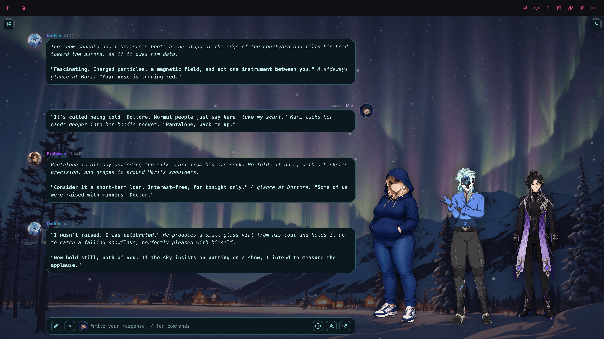
   
  <em>Roleplay Mode — Full-body character sprites, custom backgrounds, live weather effects, and chat widget styles</em>

  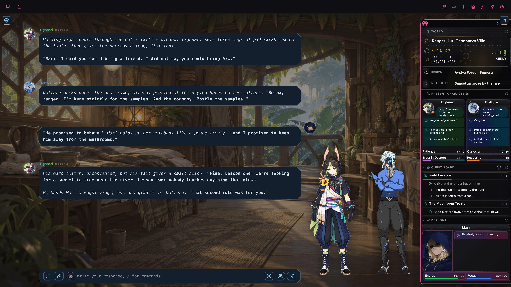
   
  <em>Tracker Panel — world state, the cast's moods and stats, quests, and your persona, docked beside the chat</em>

  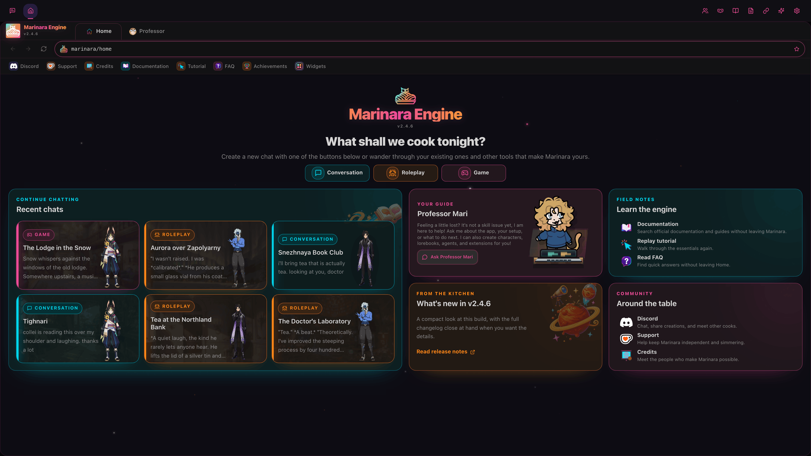
  &nbsp;&nbsp;
  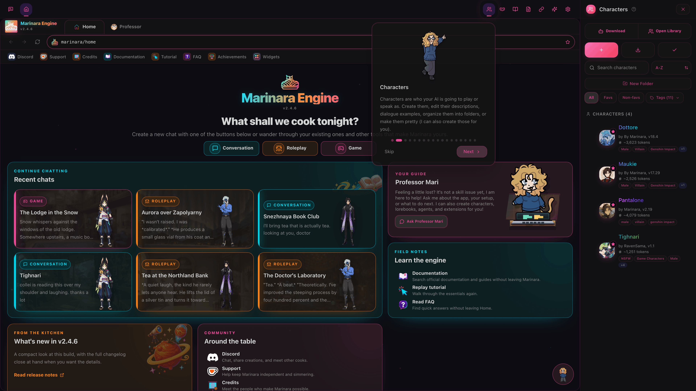

  <em>Home screen &nbsp;&nbsp;·&nbsp;&nbsp; Guided onboarding</em>

  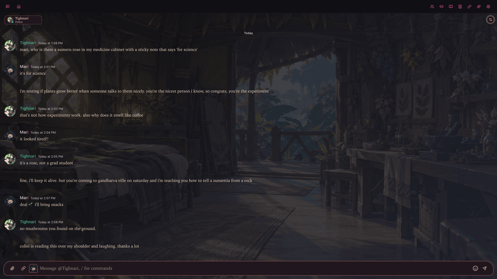
  &nbsp;&nbsp;
  

  <em>Conversation Mode — Discord-style DMs with selfies and image generation</em>

  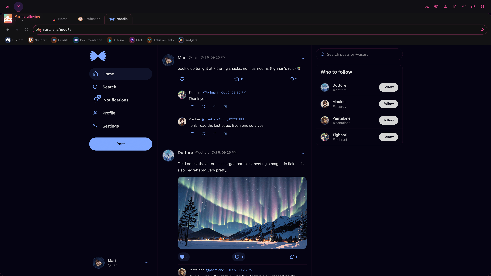
   
  <em>Noodle — a social feed where your characters post, reply, and share photos</em>

  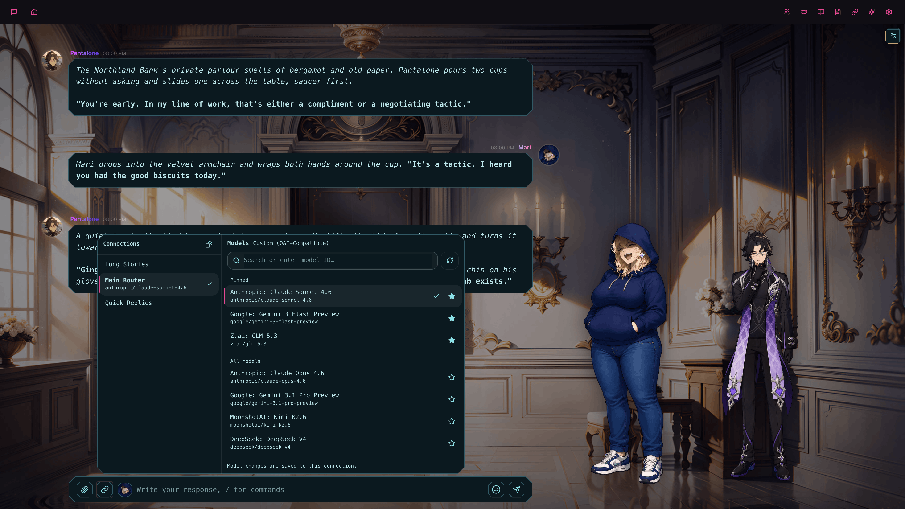
  &nbsp;&nbsp;
  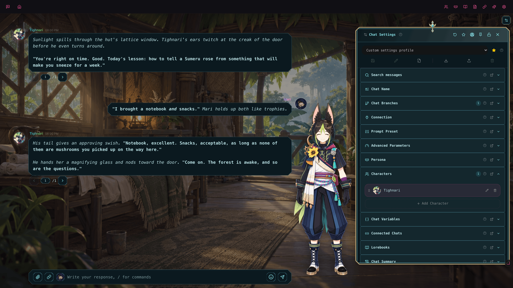

  <em>Pick and pin models right from the chat input &nbsp;&nbsp;·&nbsp;&nbsp; Chat Settings in a movable window</em>

  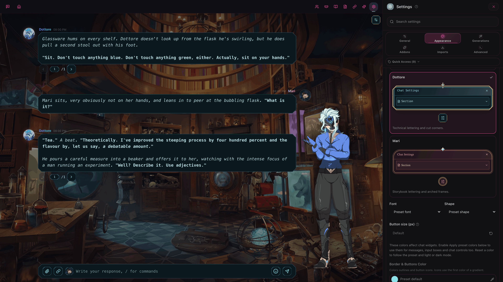
  &nbsp;&nbsp;
  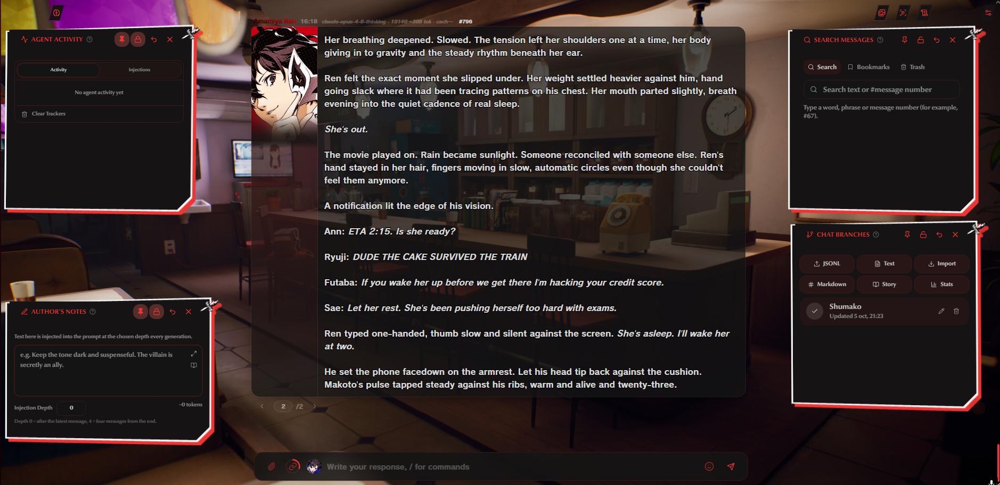

  <em>Make it yours — fonts, colors, and chat widget styles &nbsp;&nbsp;·&nbsp;&nbsp; Fully custom theming: a Persona 5-inspired look by Umi, made with custom CSS and pop-out Chat Settings windows</em>

  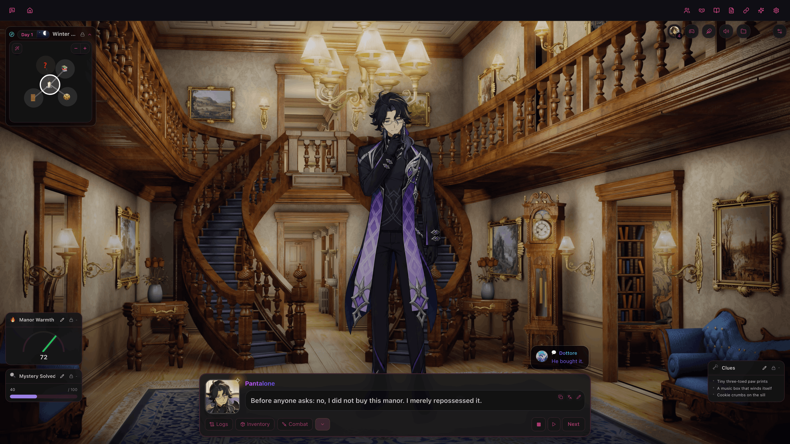
   
  <em>Game Mode — AI Game Master, party of characters, maps, HUD widgets, weather, and time of day</em>

  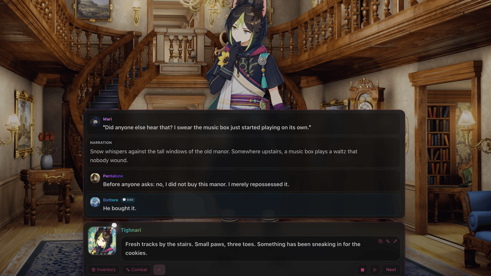
  &nbsp;&nbsp;
  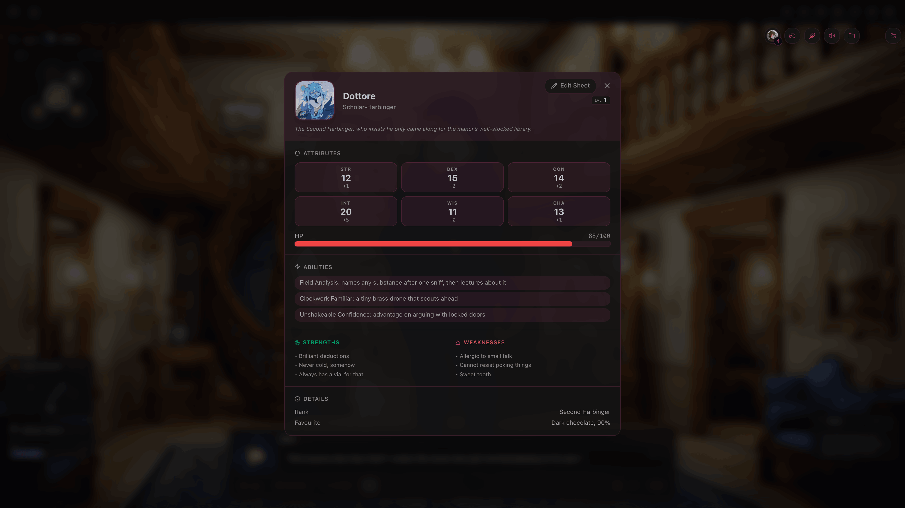

  <em>Dialogue history with party banter &nbsp;&nbsp;·&nbsp;&nbsp; Party member card with stats, abilities, strengths, and weaknesses</em>

  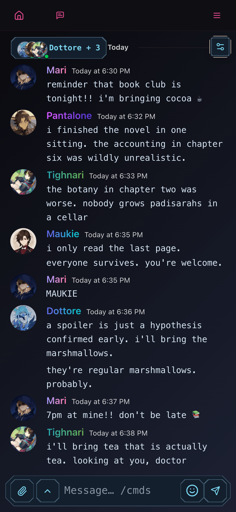
  &nbsp;&nbsp;&nbsp;&nbsp;
  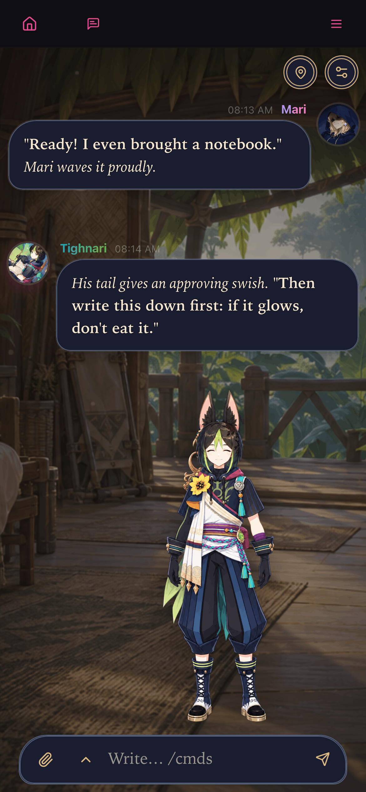
  &nbsp;&nbsp;&nbsp;&nbsp;
  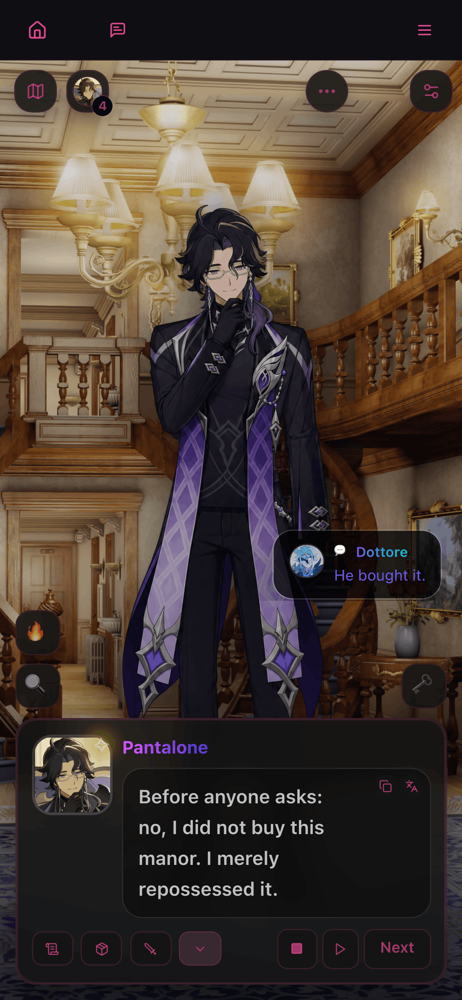

  <em>Fully responsive — Conversations, Roleplay, and Game Mode all work on phones and tablets via PWA</em>

---

## Latest Release

Current stable release: **[v2.5.0](https://github.com/Pasta-Devs/Marinara-Engine/releases/tag/v2.5.0)**.

See [CHANGELOG.md](CHANGELOG.md) for detailed release notes. Tagged releases use the `vX.Y.Z` format and are published on the [Releases](https://github.com/Pasta-Devs/Marinara-Engine/releases) page with a Windows installer, Android bootstrap APK, and named versioned source ZIP. Android APKs are Termux bootstrap + WebView shells: they can download Termux from F-Droid, launch Android's installer, start the Termux setup flow after required permission prompts, then open the local Marinara server on the same device. **[Download the latest Android APK directly](https://github.com/Pasta-Devs/Marinara-Engine/releases/latest/download/marinara-engine-android.apk).**

---

## Installation

| Platform                 | Guide                                                                                        |
| ------------------------ | -------------------------------------------------------------------------------------------- |
| 🐳 Docker / Podman       | [Container Installation Guide](docs/installation/containers.md) — recommended                |
| 🪟 Windows               | [Windows Installation Guide](docs/installation/windows.md)                                   |
| 🍎🐧 macOS / Linux       | [macOS / Linux Installation Guide](docs/installation/macos-linux.md)                         |
| 🤖 Android APK Bootstrap | [Download APK](https://github.com/Pasta-Devs/Marinara-Engine/releases/latest/download/marinara-engine-android.apk) · [Guide](android/README.md) |
| 🤖 Android Manual Termux | [Android (Termux) Installation Guide](docs/installation/android-termux.md) — manual fallback |
| 📱 iOS / iPadOS          | [iOS / iPadOS PWA Guide](docs/installation/ios-pwa.md)                                       |

> **Recommended Android path:** tap **Download APK** above, open it, then tap **Install / Start Marinara**. Choose app or browser on its launcher; the APK remembers the choice and signs in automatically. It creates and uses its private localhost credential automatically; users never provide a signing key or local-access secret. Android still shows its required app-install and Termux permission prompts. If Android blocks the automatic handoff, the [Android APK Guide](android/README.md) has the manual fallback.

Each guide covers installation, updating, and LAN access for that platform. See [Configuration Reference](docs/CONFIGURATION.md) for environment variables setup. Having trouble? See [FAQ](docs/FAQ.md) and [Troubleshooting](docs/TROUBLESHOOTING.md).

Upgrading from an older release? See [Upgrading Marinara Engine](docs/UPGRADING.md) for the platform-by-platform upgrade path.

Security defaults are intentionally local-first: loopback access works out of the box, while ordinary LAN and public clients require Basic Auth unless you explicitly opt back in. Direct Tailscale sockets and actual same-host Docker container networks are detected and trusted automatically; unrelated CGNAT, LAN, host-network, and proxy-forwarded traffic still follows normal access control. Set `BYPASS_AUTH_TAILSCALE=true` or `BYPASS_AUTH_DOCKER=true` only when you need the legacy broad compatibility bypass, or `false` when you want matching direct clients to authenticate too. Set `REQUIRE_AUTH_FOR_DOCKER_PROXY=false` only when every upstream client is trusted. `ALLOW_UNAUTHENTICATED_PRIVATE_NETWORK=true` restores unauthenticated access for other trusted private networks; public clients still require `ALLOW_UNAUTHENTICATED_REMOTE=true`. Powerful actions such as backups, bulk import, update apply, sidecar install/download/delete, haptics, and custom tool mutation also require `ADMIN_SECRET`; see [Access Control](docs/CONFIGURATION.md#access-control).

---

## Features

### Chat & Roleplay

Three chat modes — **Conversation** (Discord-style DMs), **Roleplay** (immersive RPG with sprites and backgrounds), and **Game** (AI Game Master with party, quests, and combat). Characters can share memory across modes. Create or import characters, search the multi-site Card Browser (Chub.ai, JannyAI, Pygmalion, Wyvern, and more), organize chats into folders, branch conversations, swipe between alternate responses, and import from SillyTavern.

### Visual & Immersive

Character sprites for expressions and full-body poses, including animated expressions, custom scene backgrounds, dynamic weather effects, a Visual Novel display for Roleplay, chat galleries with generated illustrations, short scene videos made from your images, text-to-speech voices, and illustrated storyboards for Roleplay and Game Mode. Some of these come from downloadable agents: Expression Engine switches sprites to match each character's mood, World State drives the weather, Illustrator draws scenes, and Storyboard builds the storyboards.

### Appearance & Themes

Make Marinara look the way you want. Most of this lives in **Settings → Appearance**:

- **Colors and style:** dark or light mode, the Marinara (retro Y2K) or SillyTavern-inspired look, background and accent colors (solid or gradient, with optional pulsing or rainbow accents), and a custom cursor.
- **Fonts and sizes:** pick the app font, add your own font files or download any Google Font, and adjust the display size, chat text size and colors, text outlines, and desktop sidebar width.
- **Chat widgets:** style the movable chat buttons, windows, and sections with the **Default**, **Dottore**, or **Mari** preset, then change their font, shape, colors (gradients too), and button size. Three switches let your messages and input box match.
- **Each chat mode:** Conversation rows or bubbles with gradient backgrounds, Roleplay in classic or Visual Novel display with your choice of avatar style, and Game Mode portrait and sprite sizes.
- **Themes:** write, import, and share custom CSS themes in the **Theme Library**, or give a character card its own look with Card CSS. Professor Mari can make themes for you.
- **Your layout:** move the chat buttons where you like and, on a computer, resize Chat Settings or pop its sections out into their own windows. Save the arrangement for new chats or in a settings profile.

See [Appearance Settings](docs/appearance/appearance-settings.md) and [Custom CSS Themes](docs/appearance/custom-css-themes.md).

### AI Agent System

Agents are optional AI helpers that work alongside your chats: they track the world, polish the prose, draw pictures, play music, and more. A fresh install comes with none, so Marinara stays light. Open **Agents → Download Agents** to install only the ones you want from the official [Marinara-Agents](https://github.com/Pasta-Devs/Marinara-Agents) catalog, then turn them on for each chat in **Chat Settings**. Marinara asks before updating an installed agent, and you can uninstall anything you no longer need. Packages marked as previews are offered only on the Engine `staging` update channel.

- **Writer Agents** shape the story and clean up the prose: Prose Guardian, Continuity Checker, Narrative Director, Knowledge Retrieval, Knowledge Router, and Card Evolution Auditor.
- **Tracker Agents** keep track of the world, the cast, and your persona: World State, Expression Engine, Quest Tracker, Background, Character Tracker, Persona Stats, Custom Tracker, Inventory Tracker, Beholder, Memory Nag, World Maps, Quartermaster, and Relationship Tracker.
- **Misc Agents** add pictures, music, memory, and extras: Illustrator, Storyboard, Music DJ, Long-Term Memory, Lorebook Keeper, Echo Chamber, Combat, CYOA Choices, Immersive HTML, Haptic Feedback, and Calls (audio and video calls in Conversation mode).
- **Conversation games** let you play against your characters: UNO, Chess, Poker, 8-Ball Pool, Tic-Tac-Toe, and Rock-Paper-Scissors.
- **Apps** are whole experiences built on your characters, each with its own Home tab: Noodle (a social feed where your characters post), Slurp (a private creator app for your characters), and Gacha Forge (a gacha game built from a world you describe). Modern Life Sim is a preview.
- **Custom Agents:** build your own with your own prompt, timing, tools, and output type, or copy an official agent and change it. Importing agents made by other people is off by default: turn on **Allow custom Agent imports** in **Settings → Advanced → Danger Zone**, then review the permissions each one asks for.

See the [Downloadable Agents Reference](docs/agents/built-in-agents.md) and [Creating Custom Agents](docs/agents/custom-agents.md).

### Prompt Engineering

Preset system with drag-and-drop prompt ordering, lorebooks with keyword triggers, an **Active Context** view of the lore each chat is using, regex scripts, and a macro/template system. Professor Mari can draft lorebooks for you.

### Local Customization

Personal Extensions are disabled-by-default drafts authored for you by Professor Mari. Every executable change invalidates approval, and only the exact reviewed SHA-256 fingerprint can run inside Marinara's restricted browser or OS sandbox. Third-party imports stay hidden until the host and user deliberately open both External Extensions safety gates. Legacy tools can request separately disclosed **Full page access** for DOM compatibility, but that mode is deliberately unsandboxed and should be enabled only for exact code you trust. See the [Personal Extensions guide](docs/extending/personal-extensions.md).

### Connections & Providers

- **Chat models:** OpenAI, Anthropic, Google Gemini, Google Vertex AI, OpenRouter, NanoGPT, Mistral, Cohere, xAI / Grok, Arli AI, Z.AI, and any OpenAI-compatible endpoint, including local servers such as Ollama, LM Studio, and KoboldCpp.
- **Subscription logins:** use your Claude Pro or Max plan, your ChatGPT account (through Codex), or SuperGrok / X Premium+ (through the Grok CLI) instead of an API key. You sign in once on the computer that runs Marinara.
- **Built-in Local Model:** a small model Marinara downloads and runs on your own machine for helper jobs such as trackers, lorebook search, and call transcription. No API key needed.
- **Images:** cloud services such as OpenAI, NovelAI, Stability AI, OpenRouter, and fal.ai, your ChatGPT login, free Pollinations and Stable Horde, and local ComfyUI, SD Web UI, SwarmUI, and Draw Things.
- **Video:** Google AI Studio (Gemini Omni and Veo), xAI Imagine, OpenRouter, NanoGPT, Atlas Cloud, Seedance 2.0, and local ComfyUI or SwarmUI workflows.
- **Voice and audio:** text-to-speech through OpenAI-compatible servers, ElevenLabs, PocketTTS, or xAI Voice, plus optional ElevenLabs sound effects and music in Game Mode.
- **Decision models:** an optional fast model that answers yes-or-no questions about the story, so agents, lorebook entries, and prompt sections switch on only when they should. Use a local model, a hosted TypeSafe or OpenRouter connection, or a server you run.

Change a connection's model right from the **Connections** menu by the chat input: search the list or type a model ID, and star models to pin them to the top. Each chat can use its own connection or pick from a random pool, and API keys are encrypted at rest with AES-256. See [Supported AI Providers](docs/connections/providers-reference.md) and [Decision Models](docs/connections/decision-models.md).

### Export & Data

Export a chat as JSONL, plain text, Markdown, or a styled HTML story, or download several chats at once as a zip of JSONL files. Fully local file-native storage — all data stays on your machine. No account required.

---

## Documentation

The full guide library is browsable inside the app: open **Documentation** from the Home screen to search every guide, organized by category. Highlights:

| Document                                                                             | Description                                                                                                        |
| ------------------------------------------------------------------------------------ | ------------------------------------------------------------------------------------------------------------------ |
| [docs/INSTALLATION.md](docs/INSTALLATION.md)                                         | Installation guide index (all platforms)                                                                           |
| [docs/CONFIGURATION.md](docs/CONFIGURATION.md)                                       | Environment variables and `.env` reference                                                                         |
| [docs/conversation/getting-started.md](docs/conversation/getting-started.md)         | Conversation Mode setup, DMs, groups, profiles (display name, about me, behavior), calls, selfies, and table games |
| [docs/roleplay/getting-started.md](docs/roleplay/getting-started.md)                 | Roleplay Mode setup, sprites, HUD, agents, and connected chats                                                     |
| [docs/game/getting-started.md](docs/game/getting-started.md)                         | Game Mode setup, world-gen, party play, storyboards, and troubleshooting                                           |
| [docs/agents/built-in-agents.md](docs/agents/built-in-agents.md)                     | Modes, behavior, and setup for the downloadable first-party agents and feature packages                            |
| [docs/noodle/overview.md](docs/noodle/overview.md)                                   | Noodle social timeline: setup, posting, interactions, images, and chat carryover                                   |
| [docs/prompts/generation-parameters.md](docs/prompts/generation-parameters.md)       | Sampler and output-parameter reference across providers                                                            |
| [docs/REMOTE_ACCESS.md](docs/REMOTE_ACCESS.md)                                       | Remote access, Basic Auth, IP allowlists, and admin access                                                         |
| [docs/conversation/calls.md](docs/conversation/calls.md)                             | Conversation audio-call setup, Local Whisper, TTS, and troubleshooting                                             |
| [docs/media/image-providers.md](docs/media/image-providers.md)                       | Image generation provider setup                                                                                    |
| [docs/media/comfyui.md](docs/media/comfyui.md)                                       | Local and RunPod ComfyUI workflow export, placeholders, reference images, and troubleshooting                      |
| [docs/media/style-profiles.md](docs/media/style-profiles.md)                         | Image style profiles and prompt grammar                                                                            |
| [docs/media/tts-setup.md](docs/media/tts-setup.md)                                   | Text to speech (TTS) setup and voices                                                                              |
| [docs/media/scene-video.md](docs/media/scene-video.md)                               | Scene-video provider setup and the Gallery animation workflow                                                      |
| [docs/game/storyboard.md](docs/game/storyboard.md)                                   | Storyboard Agent installation, global defaults, and Roleplay and Game Mode workflows                               |
| [docs/game/ltx-2-3-storyboards.md](docs/game/ltx-2-3-storyboards.md)                   | Krea 2 first frames, local LTX 2.3 ComfyUI animation, and tested Game Mode settings                               |
| [docs/agents/agents-overview.md](docs/agents/agents-overview.md)                     | Agent system overview: downloading agents, phases, per-chat setup, and custom agents                               |
| [docs/extending/custom-tools.md](docs/extending/custom-tools.md)                     | Function calling, custom tools, webhooks, scripts, and agent tool enablement                                       |
| [docs/prompts/presets.md](docs/prompts/presets.md)                                   | Preset editor, prompt sections, groups, ordering, and variables                                                    |
| [docs/extending/regex-scripts.md](docs/extending/regex-scripts.md)                   | Regex scripts, prompt/display scope, depth, order, and safety                                                      |
| [docs/agents/knowledge-sources.md](docs/agents/knowledge-sources.md)                 | Knowledge Sources, RAG, Retrieval vs Router, and embedder notes                                                    |
| [docs/characters/bot-browser.md](docs/characters/bot-browser.md)                     | Multi-site Card Browser search and character import guide                                                          |
| [docs/conversation/emoji-stickers-gifs.md](docs/conversation/emoji-stickers-gifs.md) | Custom emoji/sticker uploads and selection modes                                                                   |
| [docs/TROUBLESHOOTING.md](docs/TROUBLESHOOTING.md)                                   | Common issues and fixes                                                                                            |
| [docs/FAQ.md](docs/FAQ.md)                                                           | Frequently asked questions (LAN access, etc.)                                                                      |
| [docs/prompts/macros.md](docs/prompts/macros.md)                                     | Prompt macro syntax, including weighted random choices                                                             |
| [docs/home/professor-mari.md](docs/home/professor-mari.md)                           | Built-in assistant capabilities, limits, and safety notes                                                          |
| [docs/development/localization.md](docs/development/localization.md)                 | Supported UI languages and contribution steps for new or corrected translations                                    |
| [docs/development/frontend.md](docs/development/frontend.md)                         | Frontend architecture, components, hooks, and API reference                                                        |
| [docs/development/architecture-map.md](docs/development/architecture-map.md)         | Code ownership map and module-boundary refactor groundwork                                                         |
| [android/README.md](android/README.md)                                               | Android Termux bootstrap + WebView shell guide                                                                     |
| [CONTRIBUTING.md](CONTRIBUTING.md)                                                   | Contributor workflow, validation, versioning, and release steps                                                    |
| [CHANGELOG.md](CHANGELOG.md)                                                         | Release notes                                                                                                      |
| [AGENTS.md](AGENTS.md)                                                               | Maintainer notes for coding agents                                                                     |

---

## Community & Support

- [**Join our Discord**](https://discord.com/invite/KdAkTg94ME) — Chat, get help, share characters, and give feedback
- [**Support on Ko-fi**](https://ko-fi.com/marinara_spaghetti) — Help keep the project alive

---

## Contributors

  

  Made with <a href="https://contrib.rocks">contrib.rocks</a>.

---

## License

Marinara Engine source code is licensed under the [GNU AGPLv3](LICENSE).

## Trademark & Branding

The software license does not grant permission to imply that a third-party
product or hosted service is official, endorsed, certified, or supported by
Pasta-Devs. Ordinary truthful descriptive and nominative references to Marinara
Engine remain welcome. When a reference is used to market or operate a hosted
service, its operator and independent status must be clear. See the [Trademark
and Branding Policy](TRADEMARKS.md) for the complete guidelines.

_olud.ai is an independent third-party service and is not endorsed by Pasta-Devs._

